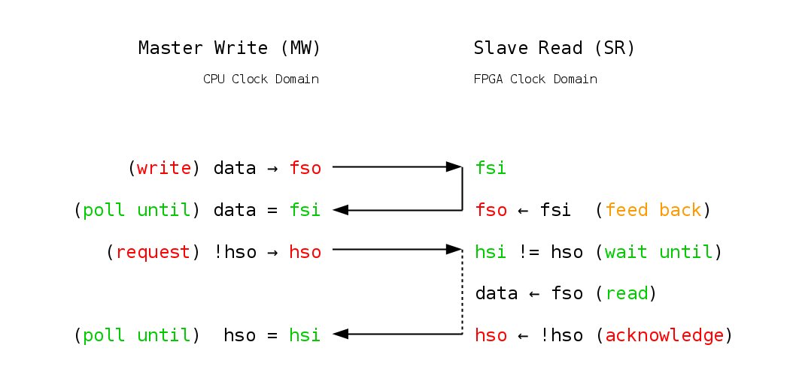
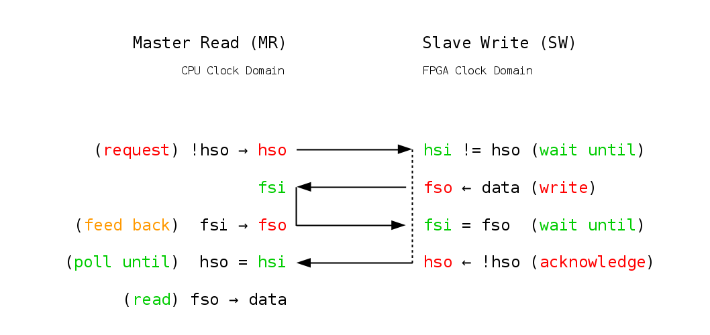

> This file is part of fsio, see <https://qu1x.org/fsio>.
> 
> Copyright (c) 2016 Rouven Spreckels <n3vu0r@qu1x.org>
> 
> fsio is free software: you can redistribute it and/or modify
> it under the terms of the GNU Affero General Public License version 3
> as published by the Free Software Foundation on 19 November 2007.
> 
> fsio is distributed in the hope that it will be useful,
> but WITHOUT ANY WARRANTY; without even the implied warranty of
> MERCHANTABILITY or FITNESS FOR A PARTICULAR PURPOSE. See the
> GNU Affero General Public License for more details.
> 
> You should have received a copy of the GNU Affero General Public License
> along with fsio. If not, see <https://www.gnu.org/licenses>.

fsio
====

Feedback Synchronized I/O

Installation
============

Either getting a release
------------------------

1. Download stable source distribution tarball.

		wget https://qu1x.org/file/fsio-1.0.1.tar.xz

2. Extract and enter.

		tar -xJf fsio-1.0.1.tar.xz
		cd fsio-1.0.1

Or getting a snapshot
---------------------

Required dependencies:

		git autoreconf libtool

1. Clone repository.

		git clone https://github.com/qu1x/fsio.git

2. Enter and generate latest source distribution.

		cd fsio
		./bootstrap

Installing one of them
----------------------

Required dependencies:

		build-essential libpugixml

1. Configure, build, and install.

Two features, `--enable-stat` and `--enable-wait`, can be enabled.

		./configure --sysconfdir=/etc
		make
		sudo make install

2. Keep to uninstall someday.

		sudo make uninstall

Usage
=====

RTFM:

		man fsio
		man fsio-tvgen

Have a look at the package definition and the top-level loopback example:

		less fsio.vhd
		less fsio_top.vhd

Communication Protocol
======================

The CPU or processing system (PS) acts as master and requests data to be either
written or read while the FPGA or programmable logic (PL) acts as slave and
serves these requests followed by acknowledging them. The handshake signal as
well as the data signals are feedback in order to synchronize communication,
hence the name Feedback Synchronized I/O (fsio),

The AXI GPIO IP Core from the Xilinx Vivado IP Catalog provides a dual-channel
mode allowing the first channel to be input only and the second channel to be
output only. This suits the protocol well since one of the two channels can be
used as feedback loop reducing the number of maps to not bloat the block design.
An instance of this IP Core is here referred to as map. A communication channel
is made up of a handshake map of one signal and one or more data maps of up to
32 signals.

The mapping is stored in an XML file, a channel description file. It
is passed to the file transfer application named fsio and parsed by the library
named libfsio.

		<fsio>
			<hs i="0x41200000" o="+0x8" width="1"/>
			<fs i="0x41210000" o="+0x8" width="4"/>
			<fs i="0x41220000" o="+0x8" width="4"/>
			<fs i="0x41230000" o="+0x8" width="4"/>
			<fs i="0x41240000" o="+0x8" width="4"/>
		</fsio>

In both figures, the CPU on the left and the FPGA on the right represent an
unidirectional communication channel. The arrows indicate the two feedback loops
of each figure, one for the data and one for the handshake. A loop has both
input and output mappings, labeled “fsi” and “fso” for the data, and “hsi” and
“hso” for the handshake, respectively. What is labeled as input for the CPU, is
labeled as output for the FPGA, and vice versa. Time flows from top to bottom,
except for the orange colored feeding which is done continuously on the FPGA and
alternately with the handshake polling on the CPU.

The master write routine firstly writes the data, and repeatedly reads it back
until they are equal. Then it toggles the handshake signal requesting the FPGA
to read the data. Afterwards, the slave read routine of the FPGA acknowledges
the request by feeding back the toggled handshake signal for which the CPU is
waiting for by polling it.

In contrast, the master read routine firstly toggles the handshake signal
requesting the FPGA to write data while the CPU repeatedly feeds it back. The
slave write routine of the FPGA compares the written with the fed back data
until they are equal. Afterwards, it acknowledges the request by feeding back
the toggled handshake signal, allowing the CPU to finally read the data.

Performance Measurements
========================

	SoM: Avnet PicoZed 7Z030
	SoC: Zynq XC7Z030 (-1)
	CLK: 180 MHz
	eOS: Xilinx PetaLinux 2015.4
	CXX: arm-linux-gnueabi-gcc -std=c++14 -O3 (4.9.2)

Write Rate (PS to PL)
---------------------

| Maps | Channel Width (B) | Rate (MB/s) | Rate Uncertainty (MB/s) |
| ----:|:----------------- | -----------:|:----------------------- |
|    1 | 4                 |       4.540 | 0.006                   |
|    2 | 8                 |       6.288 | 0.016                   |
|    3 | 12                |       7.231 | 0.008                   |
|    4 | 16                |       7.798 | 0.015                   |
|    5 | 20                |       8.095 | 0.038                   |
|    6 | 24                |       8.452 | 0.009                   |
|    7 | 28                |       8.672 | 0.010                   |
|    8 | 32                |       8.827 | 0.010                   |
|    9 | 36                |       8.986 | 0.016                   |
|   10 | 40                |       9.095 | 0.013                   |
|   11 | 44                |       9.135 | 0.012                   |
|   12 | 48                |       9.203 | 0.015                   |
|   13 | 52                |       9.314 | 0.013                   |
|   14 | 56                |       9.386 | 0.013                   |
|   15 | 60                |       9.452 | 0.013                   |
|   16 | 64                |       9.472 | 0.014                   |
|   17 | 68                |       9.461 | 0.015                   |
|   18 | 72                |       9.480 | 0.015                   |
|   19 | 76                |       9.555 | 0.018                   |
|   20 | 80                |       9.594 | 0.019                   |
|   21 | 84                |       9.630 | 0.017                   |
|   22 | 88                |       9.652 | 0.017                   |
|   23 | 92                |       9.679 | 0.017                   |
|   24 | 96                |       9.687 | 0.018                   |
|   25 | 100               |       9.717 | 0.018                   |
|   26 | 104               |       9.733 | 0.018                   |
|   27 | 108               |       9.737 | 0.019                   |
|   28 | 112               |       9.734 | 0.019                   |
|   29 | 116               |       9.735 | 0.019                   |
|   30 | 120               |       9.734 | 0.020                   |
|   31 | 124               |       9.736 | 0.020                   |
|   32 | 128               |       9.733 | 0.021                   |

Read Rate (PL to PS)
--------------------

| Maps | Channel Width (B) | Rate (MB/s) | Rate Uncertainty (MB/s) |
| ----:|:----------------- | -----------:|:----------------------- |
|    1 | 4                 |       0.855 | 0.057                   |
|    2 | 8                 |       1.567 | 0.091                   |
|    3 | 12                |       2.184 | 0.114                   |
|    4 | 16                |       2.722 | 0.123                   |
|    5 | 20                |       3.191 | 0.131                   |
|    6 | 24                |       3.605 | 0.130                   |
|    7 | 28                |       3.979 | 0.126                   |
|    8 | 32                |       4.337 | 0.118                   |
|    9 | 36                |       4.611 | 0.110                   |
|   10 | 40                |       4.894 | 0.102                   |
|   11 | 44                |       5.052 | 0.086                   |
|   12 | 48                |       5.319 | 0.077                   |
|   13 | 52                |       5.507 | 0.063                   |
|   14 | 56                |       5.676 | 0.058                   |
|   15 | 60                |       5.862 | 0.042                   |
|   16 | 64                |       6.049 | 0.030                   |
|   17 | 68                |       6.167 | 0.020                   |
|   18 | 72                |       6.276 | 0.009                   |
|   19 | 76                |       6.405 | 0.008                   |
|   20 | 80                |       6.534 | 0.015                   |
|   21 | 84                |       6.626 | 0.022                   |
|   22 | 88                |       6.738 | 0.026                   |
|   23 | 92                |       6.848 | 0.030                   |
|   24 | 96                |       6.958 | 0.031                   |
|   25 | 100               |       7.017 | 0.031                   |
|   26 | 104               |       7.092 | 0.032                   |
|   27 | 108               |       7.195 | 0.030                   |
|   28 | 112               |       7.266 | 0.027                   |
|   29 | 116               |       7.335 | 0.027                   |
|   30 | 120               |       7.385 | 0.025                   |
|   31 | 124               |       7.438 | 0.025                   |
|   32 | 128               |       7.545 | 0.021                   |

Version
=======

fsio-1.0.1 <https://qu1x.org/fsio>

License
=======

GNU Affero General Public License version 3

Authors
=======

* Copyright (c) 2016 Rouven Spreckels <n3vu0r@qu1x.org>

